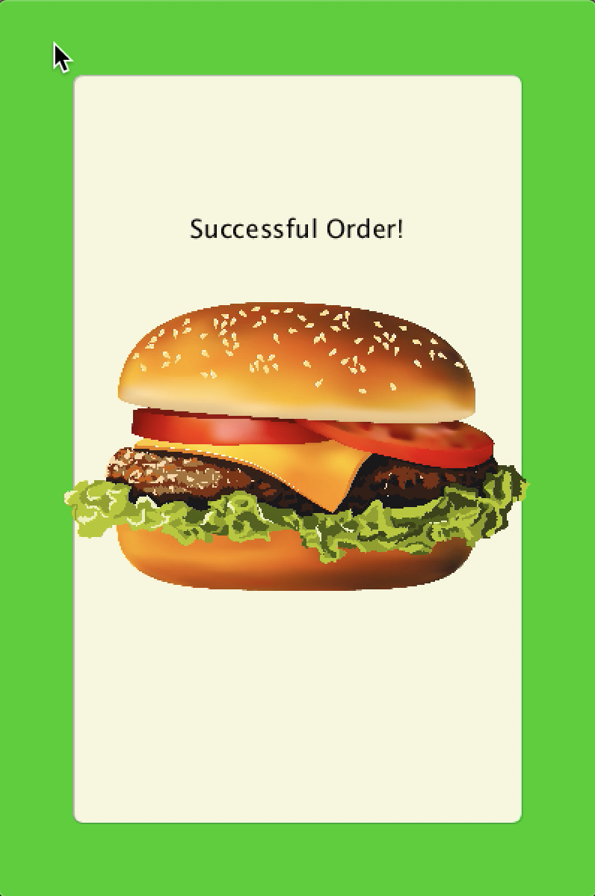

**Final Project**

For my final project, I was inspired by a concept that is somewhat common, similar to games where you are required to build the longest tower using the blocks that fall from the sky, but the idea specifically is relatively new.

The game is similar to Sky Burger, which is a game that you can download on your smartphone. You can watch a video of the game being played [Here](https://www.youtube.com/watch?v=L0LIzSpDEG8&t=60s).

A video of my own version of the game can be accessed using this [link](https://drive.google.com/file/d/1DLH2D2MQI0c9ZGYY3JCvyCR178lys7-d/view?usp=sharing).

The goal of the game is to take the customer's order and ensure that you place all the required ingredients in the burger before you place the top bun. Once the top bun is placed, the game ends and you get to know whether you made the correct order or not. 

- The game initially starts with:
  * a bun at the bottom of the screen 
  * a price of $0
  * a tip of 0%
  * the customer's order at the top, with the number of each ingredient required (randomized)

As displayed below:

  
- When you start playing the game:
  * random ingredients start to descend from above
  * you can control the movement of the bottom bun using the mouse
  * when an ingredient lays on the bottom bun or another ingredient:
    - it sticks to it
    - the number displayed in the order decreases
    
- When the top bun is placed on the burger:
  * the game internally checks the constituents if the burger
  * if the ingredients are placed correctly as the order requires, the screen will display that it was a successful order
  * if not, the player would know that they failed 
  
If order is successful :

I used Daniel Shiffman's code for the ["Rain Catcher Game"](http://learningprocessing.com/examples/chp10/example-10-10-rain-catcher-game) in Algorithms as reference when I started coding.

Problems that I encountered:
 * When I had the ingredients as an array, for some reason, when it hit the bottom bun, it moved sideways with it if I was moving the mouse slowly, however when I moved it faster, it got detached, and so I made it into an array list and it was fixed.
 
 * I initially made the top bun as a separate class but I had trouble using it and associating it with the burger, so I added its image to the ingredients array list and referred to it using its type and when it was caught, I ended the game.

