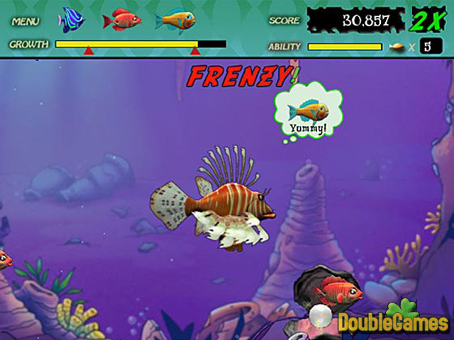
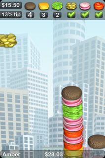

**Final Project**

For my final project, I have two ideas in mind, one inspired by a game I loved playing as a child and then other one is relatively new.

The first game is called [Feeding Frenzy](https://www.youtube.com/watch?v=NlcUbZO8pAM), and below is a screenshot of the game:

The goal of the game is to eat the most number of smaller fish and gain more points as well as and avoid being eaten by the bigger fish. 

- The more fish you eat, the bigger you get 
- When you get bigger, you get the ability to eat bigger fish 
- Bigger fish give you more points than smaller fish 
- You lose if you hit a bigger fish

The second game is called [Sky Burger](https://www.youtube.com/watch?v=L0LIzSpDEG8&t=60s), and below is a screenshot of the game:

The goal of the game is to ensure that before you place the top bun of the burger, the items ordered by the customer are placed inside:

- You initially starts with a bun at the bottom of the screen
- Random ingredients fall from above
- You move your phone sideways to collect the items on top of one another -> for the computer movement I will control it using the arrow keys 
- Above, are a list of items that the customer ordered, and you are supposed to ensure that he gets his order
- Another aspect that can be added is trying to make a burger of the highest length (a different goal)
