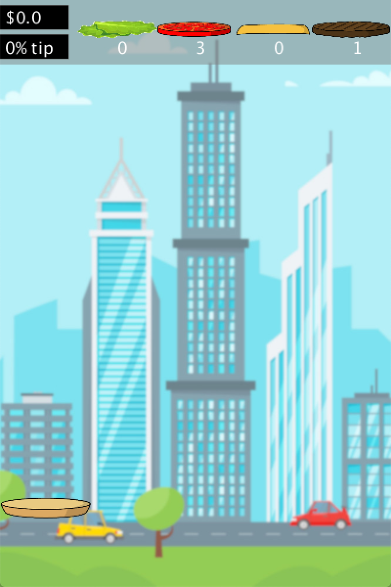

**Final Project**

For my final project, I was inspired by a concept that is somewhat common but the idea specifically is relatively new.

The game is similar to one you can find on smartphones called Sky Burger, you can watch a vide of the game being played [Here](https://www.youtube.com/watch?v=L0LIzSpDEG8&t=60s).

The goal of the game is to ensure that before you place the top bun of the burger, the items ordered by the customer are placed inside:

- When you run, the game initially starts with:
  * a bun at the bottom of the screen 
  * a price of $0
  * a tip of 0%
  * the customer's order at the top, with the number of each ingredient required (randomized)

As displayed below:

  
- When you start playing the game:
  * random ingredients start to descend from above
  * bottom bun movement is controlled by the mouse, moving sideways
  * when an ingredient lays on the bottom bun:
    - it sticks to it
    - the number displayed in the order decreases
    
- When the top bun is placed on the burger:
  * the game internally checks the constituents if the burger
  * if the ingredients are placed correctly as the order requires, the screen will display that it was a successful order
  * if not, the player would know that they failed 
