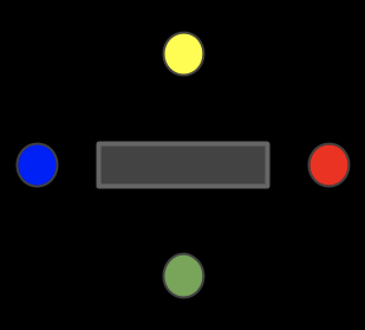

**Reaction Time Game!**

[Here](https://drive.google.com/open?id=1-N25jArjPMgMbU1xtlFE2Zk_-gS8c6RX) is a video of the game being played!

CONCEPT: For the midterm project, I wanted to use new elements that I haven’t used before in previous projects. As I looked around the lab, I found the LED buttons and so I thought they would be very interesting to work with, as they look presentable and would make the final outcome look like an actual game. My first thought with the LED buttons was to make a memory game, where the LEDs light up in a certain pattern and the player is expected to memorize it and do it correctly. However, I found that others in the class were doing the same game so I wanted to do something different so that we can look at different projects and learn from one another. Accordingly, I decided to do a reaction time game where an LED would light up, and the player would be expected to click the button as fast as possible and have their reaction time printed on an LCD. To make it more fun and interactive, I decided to make it a 4-player game.

PROTOTYPING: For the setup, the one thing I was sure of was that I will use the LED push buttons, but no one around me knew how it is used, so I used [this video](https://www.youtube.com/watch?v=GlkFYAMBhoU) for reference and was able to figure out that it operates as both a button and a switch so, from the four pins on the bottom of the button, two operate the bulb and two operate the button. 

This is what the button looks like from below.  

The two on the left are for the switch and the two on the right are for the LED, accordingly, I cut long pieces of stranded wires, soldered them in, and insulated them with plastic. This process took a very long time as I had to do it for 16 wires, 4 for each LED. I then noticed that they are not easily plugged into the breadboard and the Arduino, so I had to go over them all again and solder small pieces of stripped solid wire onto the tips for better stability and more convenient use, as well as insulating them with plastic. 

Next, I used the guide provided with the kit to pin the LCD screen onto the breadboard and connect it to the pins in the Arduino. This also included connecting the potentiometer and having a wire between the middle pin of the potentiometer and one of the pins of the LCD screen. I placed it incorrectly the first time so the LCD screen heated up and so I had to disconnect the circuit and figure out what I have done wrong. 

Once all of the wires were pinned and all the connections were made, I used the built-in Arduino examples to make sure that they were all placed correctly and operate properly. I made sure that the LEDs light up, they are connected to the button pressed and work accordingly, and that the LCD screen works properly. I had a problem with the screen however as it wasn’t displaying any text, but I had to go through the code and every pin to make sure that I haven’t missed anything until I got it to work. 

Below is an image of the prototype:
 

And a closer look at the wiring:
 

Schematic:
 

CODING: With all the elements functioning and correctly operating, I then began writing the code for the game. I got the code format for the LCD from the example provided on Arduino and changed pin numbers in accordance to how I set it up myself. In regards to the reaction time code, not only was it very difficult to find online, but it was also difficult to find one that actually works. The closest code I got and used for reference was obtained from [here](https://www.instructables.com/id/Arduino-Reaction-Time-Tester/). I used it for one LED button, adjusted the code to work and modified it for all pushbuttons. I set constant variables for all LEDs and switches, as well as a few boolean variables that are used later within the code, and set the LEDs as outputs and switches as inputs. The screen is also initialized displaying “Press any button to start!”, to make sure that the players are ready and the game is still not called. The code itself is explained in the comments, but the game starts once any of the players press on their button. When a button is clicked, the variable “started” is stores as True and hence the game begins. For every button, there are several if statements that check what action is occurring at any specific moment, this is also thoroughly explained within the code. When the game starts, the LCD screen displays the phrase “Get ready!” and stays up for a randomized number of seconds between 2-5 and when the duration is over, all LEDs light up, the screen displays “Go!” and the timer starts. The first player that presses on the button wins, and so the Stop function of that specific button is called and accordingly the screen displays the color that won as well as the time it took. This screen stays up for 2 seconds before the setup() function is called again and the game starts from the beginning. 

DESIGN: When I made sure that the code was working correctly and there weren’t any issues with the buttons nor the LCD screen, I then began to design the project. In my initial plan where I had intended to get the reaction time of just one button, I was considering having just one person play with 4 buttons and in that case, I was going to have the four buttons in a row next to one another and the LCD screen above them. When I thought of making it more engaging and adding players, I tried my best to make it in a way to use the least amount of plastic but also giving all the players space. Below is the sketch I made:
 

I then took the measurement of the perimeter of the rectangular LCD screen and the circumference of the LED bulbs in order to carve them in. I chose black acrylic as it makes the game seem a lot like an arcade, and so it looks more attractive. I then took the sketch and measurements and had it laser printed. A video portion of how it was cut is available [here](https://drive.google.com/open?id=1UIjThPyiD97_FTdYQRHq-1_LbHXl04R1). I also cut a blank, uncarved black piece of acrylic of the same size as a base to keep my Arduino and breadboard in place. A lab assistant also helped me with a few technicalities in regards to holding things into place, so we also made holes in the four corners to put and bolts and we made holes around the corners of the LCD screen to put zip ties.

I then plugged the LED pushButtons in through the top and held them down in the Arduino at the bottom. I then noticed that the LCD screen’s pins are in the breadboard so I had to get several ‘female to male’ wires to act as long pins. I didn’t find enough female to male wires so I had to improvise and connect ‘female to female’ wires to ‘male to male’ wires. With that, all connections were made and the game design was complete. 

This is the side view of the wiring:
 

PROBLEMS: 
- Not finding 4 screws of the same length → placing the bolt a bit below the expected place to make the longer screws shorter and ensure stability

- Lack of availability female-to-male wires → had to connect ‘female to female’ wires to ‘male to male’ wires

- Error with the game where, when a player keeps their finger placed on the button after the “Press any button to begin!” screen is displayed, the game still starts and once the LEDs light up, this person wins → created a boolean called ‘hold’ initialized by true and as long as the game timer has not started, a while loop continues to check if the button is held down, and if it is, the screen asks the player to remove their hand

- Error with the game where, when a player keeps their finger held down on the “Get ready!” screen, they still also win, this is an error I haven’t fixed, but could be fixed by having the same boolean for the “Get ready!” screen as well

- Error with LCD, would display weird characters after the seconds → changed the elapsedTime to a string when printing
