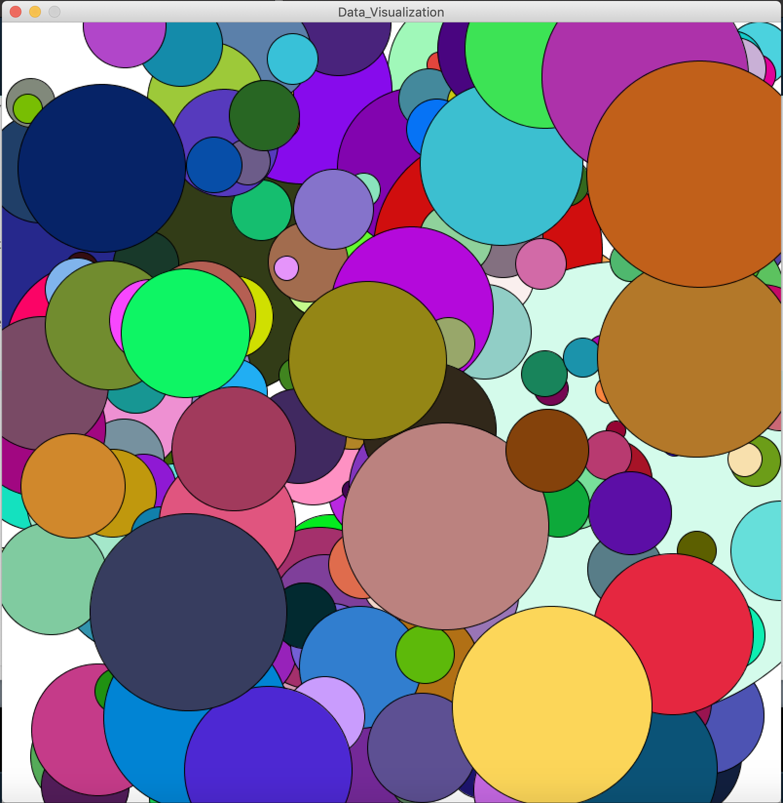

**Data Visualization**

For this assignment, I decided to create a visualization from McDonald's Data. 

I gathered their nutrition data from [here](https://www.kaggle.com/jadeblue/openfoodfactsclean), with 6 columns for:
- Category 
- Product Name
- Calories
- Fat (g)
- Carbs (g)
- Proteins (g)

The overall concept of the visualization is to present the calories present in the different items on the menu as different circle sizes.

Below is an image of the visualization:

