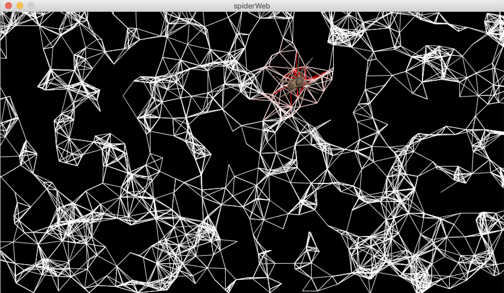

**The Spider Web**

For this assignment, we are expected to experiment with the example Aaron demonstrated for us in class. So I decided to use the program to create a spider web.

[Here](https://drive.google.com/file/d/1cJCYzXYQ6dav0GhlE2qweuLnW80XI66K/view?usp=sharing) is the video of what is displayed.

What I did is that I used the lines as a spider's web, so I increased the number of lines so that they are more connected. I also added an image of a spider and had it's center move with the position of the mouse. Wherever the spider is, the area around it changes color, where the closer parts to the spider are red, like blood, and the area a bit further away is pink, as if the color stained the web. 

Below is an image of what it looks like:

The changes I made are:
- Black background to bring up the net
- Added a spider that moves with the position of the mouse 
- checked if the distance from the mouse is less than 60, and if so, the color of this area of the lines would turn to pink
- checked if the distance from the mouse is less than 20, and if so, the color of this area of the lines would turn to red
