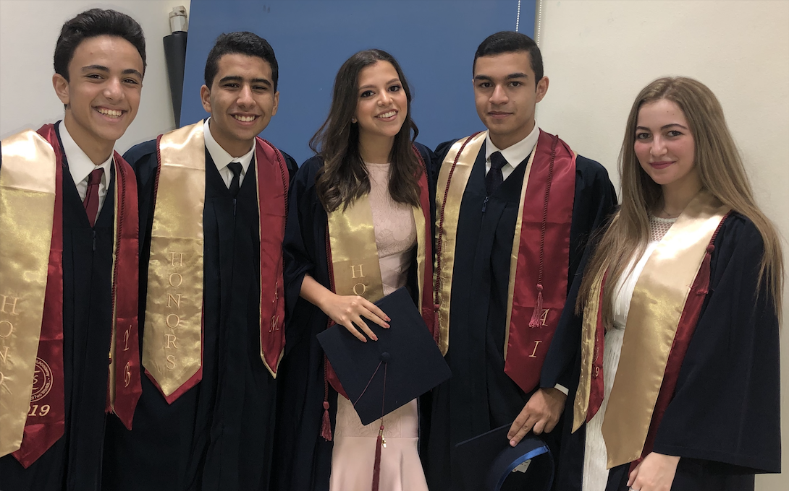

**Creative Image**

For this assignment, we are required to make a creative image using both PImage and Pixels. So I decided to play around with an image from my graduation of me and 4 of my friends that came to NYU with me.

What I did, is that I had the image display normally, and when the mouse is clicked, it does an effect that is quiet common, dividing the image into four quarters of different tint/colors based on pixels. 

[Here](https://drive.google.com/file/d/1lI9jLc3gQ_E8NU1Q1x_s3aChv-8fs-Ok/view?usp=sharing) is a video of what happens when the mouse is clicked.

Below is the normal image:

This is the image when the mouse is clicked:

