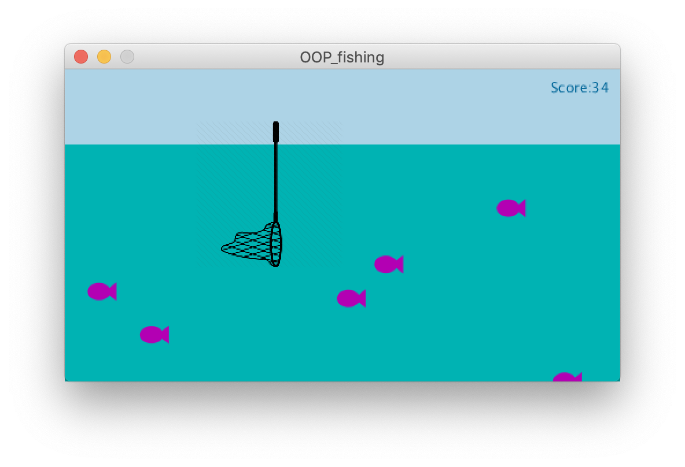

**Object Oriented Programming**

[Here](https://drive.google.com/open?id=1QbRHx-PQfVp6QV9rk692ubnGLHZ6tMEq) is a video of the game being played!

For this assignment, I decided to create a short fishing game using object oriented programming (OOP). 

In the game, 500 fish enter the screen from the right side and move to the left and exit the screen. The player has a net and the **goal** of the game is to collect the greatest number of fish using the net (from the 500 fish), and the score for the player is displayed on the top right of the screen to track the number, it increases with the number of fish you were able to catch with your net. 

Below is an image of the game:
 

There are 2 folders I uploaded for the game, one called OOP which I was actually working with as I had each class in a different tab for clearer and easier access. The OOP_fishing folder however has the whole code in one file for copying and pasting.

Problems I ran into while working on the game:

 - Fish being caught whenever it hits the image of the net itself at any point and not the actual piece that actually collects the fish -> I fixed this by adding to the x and y coordinates of the net image (in reference to the 0,0 position), where I made sure it hits the net itself
 
 - Net would leave the screen at the bottom and the left as it moves with the x and y coordinates of the mouse so I added the following code to prevent it from leaving the screen:
 
 if (net.y + 128 > height) {
 
    net.y = height - 128;   
    }
    
 if (mouseX - 128/2 < -20) { 
 
    net.x = -22;    
    }
 
 - Trying to collect the fish inside the net rather than making them disappear -> with that however, since I added it inside the caught() function, it kept repeating in a loop and hence increased the score which made it inaccurate. I tried to use the noise() function but it would not work for the positon of the part of the net that collects the fish, it only gathered them at the top left corner of the image 

References:
https://www.iconfinder.com/icons/358590/fishhook_fishing_tackle_fishnet_fly-fishing_hand-net_hook_lake_icon
http://learningprocessing.com/examples/chp10/example-10-10-rain-catcher-game
https://www.openprocessing.org/sketch/42290/#
