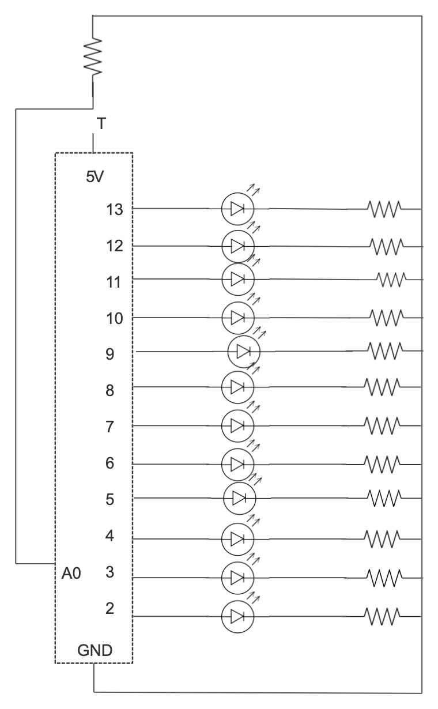

**Uno Dos Tres Cuatro**

The LED bulbs blink to the beat of "I know you want me" by Pitbull, and once the switch is clicked, the bulbs follow the change in the beat by doing a pattern when he says "One Two Three Four" and then reverses the order when he says "Uno Dos Tres Cuatro".

Below is an image of the schematic diagram:

They are set up with four of each of the following colors: yellow, green, blue. So when the button is clicked, the first of each color blinks and then it moves to the next, when he starts saying "Uno Dos Tres Cuatro", the last bulb lights up first. 

This is how I set it up:

