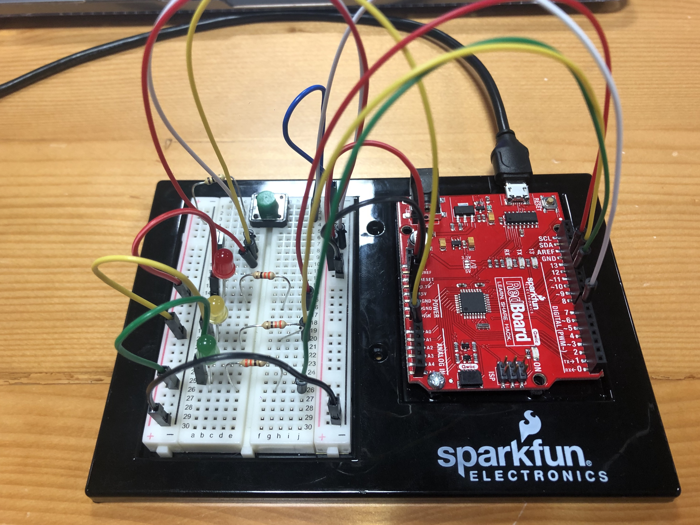

For this assignment, I decided to use a tempertaure sensor and 3 LEDs; a green one, a yellow one, and a red one. 

My initial plan was to measure the body temperature by putting the user's finger on the sensor and accordingly, with a temperature of 35-36, the green one would light up, 37-38 the yellow one would light up and 39-40 the red would light up, and if it is more than that then the red one would start blinking. 

However, the temperature was not measured correctly so I used the weather of the surrounding and got the range through the serial reader. Accordingly, I set it up such that if the temperature is less than 23, nothing would light up. If the temperature is between 23 and 23.25, the green would light up. If the temperature is between 23.25 and 24.0, the yellow would light up. If the temperature is between 24.0 and 24.25, the red would light up. If it is more than 24.25, then the red bulb would start blinking.

I also added a switch, which when pressed, would light up all 3 bulbs with a moderate brightness.

You can find a video of it being operated [here](https://drive.google.com/open?id=133r7maOybzyNMxBiKWtDzkW90kiPFNYb). 

Below are images of how I set it up:
 

And this is the schematic:

I also used the guide we had provided in our SparkFun Inventor's Kit as reference for gettimg a formula that would obtain accurate results of the temperature cause I had trouble at first since the temperature measured was over a thousand.
