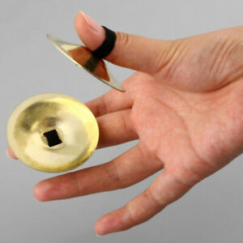

**This is the musical instrument I decided to do for this project**
For this assignment, I decided to create an Egyptian instrument called the 'Cymbal' as I thought it would be different and not a lot of people would think of it or do it. 

The Cymbal is an ancient Egyptian instrument that one can use with two fingers and basically clap both sides together. Below is an image of the finger cymbal, what it looks like and how it is used:

To recreate it, I used two servos, each one representing a hand, and set the code to turn both of them 45 degrees, as I hold them in opposite directions, such that are in a loop where they hit and go back to their initial position. Alongside the cymbals, I set a tone that the buzzer plays, which the instrument also follows.

You can find a video of it being operated [here](https://drive.google.com/file/d/144ctImUvDLF6jFd-CKlHmOJfodIzusMn/view?usp=sharing). 

[Here](https://drive.google.com/file/d/1lYQ8fBE1BHXv07JaCR0ED1gq0FDoH6t9/view?usp=sharing) is also a close-up of the instrument itself. 

Below is an image of how I set it up:
 

A close-up as well:
 

Schematic diagram:
 
