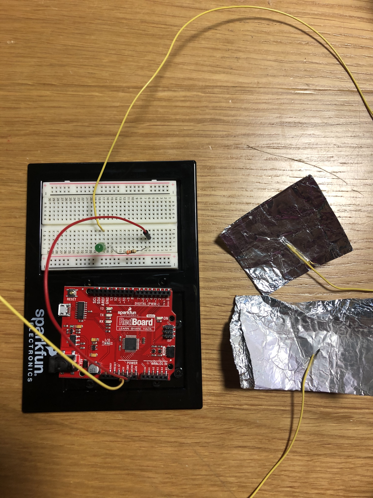

**Here is the description of my hands free switch**

For this assignment, I made a switch controlled by something I would do in my typical week; doing bicep curls with dumbbells. The idea seemed very interesting for me as I believe that it could be a convenient way of both saving and producing power or electricity. Not only that, but it would also allow the user to push themselves such that they carry the dumbbell all the way, especially if it is heavy, to reach the desired results through the satisfaction of the light bulb lighting up.

What I did is that I cut two longer pieces of wire to make sure that I will be able to control it and freely move my arm. I then connected one side of each wire in series with the LED bulb and the resistor, such that when their loose ends touch, they close the circuit.

**Below is an image of my setup**

Accordingly, I got two pieces of foil, to increase the surface area of contact between both wires, as foil conducts electricity. I then stuck the loose end of both wires to a piece of foil that I then taped to my arm as shown below. 

When the dummbell is raised and the pieces of foil touch, the bulb lights up.

I had trouble figuring out how I will be able to tape the foil on my arm in a way such that it both sticks to my arm and does not fall off, as well as trying to avoid covering the whole piece of foil so that the pieces of foil touch, seeing that tape does not conduct electricity, and hence would not allow the electrons to pass through. I solved this problem however by taping the foil to my arm from the edge further away, as in the edge closer to my hand and shoulder, rather than my elbow.

