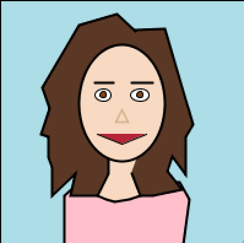

**Self-portrait**

For this assignment, I was required to draw a self-portrait of myself using processing. I tried my best to make the features look similar to what they are in real life.

A screenshot of the self-portrait is uploaded below:

Some of the features I focused on include:
- Small nose
- Wavy, short hair
- Pink blouse (very common of me to wear)
- Neck shape

Some difficulties I encountered were in regards to the vertices and how they do not make the features look and seem smooth, so I had to add a lot of them in order to make it more realistic and more aethtetically pleasing; the hair took me the longest time.
