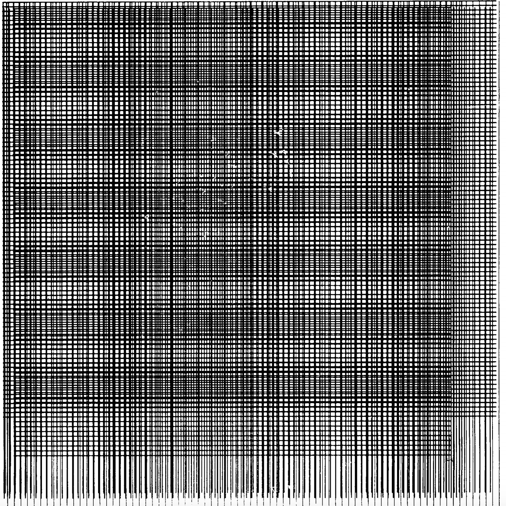
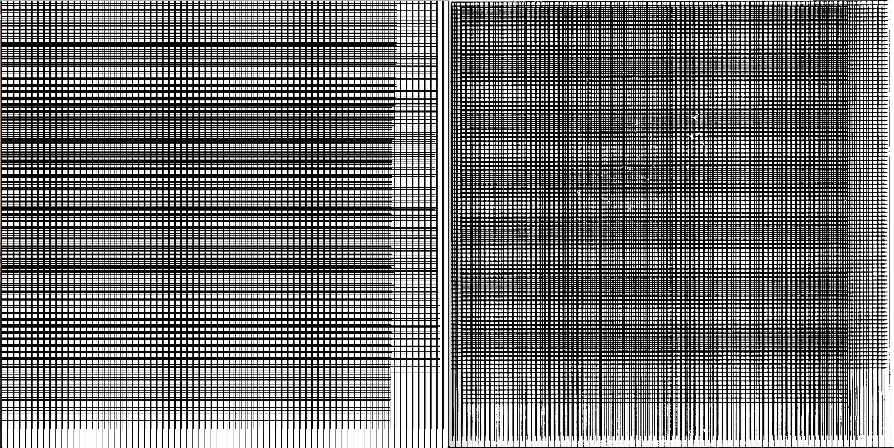

**Recreating Old Computer Art**

For this assignment, we were assigned to recreate an old computer art, so I chose the one on page 20 in [this](http://dada.compart-bremen.de/docUploads/ProgrammInformation21_PI21.pdf) pdf.

Below is an image of the original picture that I used:
 

The following is a comparison of the one I drew and the original picture, mine is the one on the left and the original one is on the right.
 

I drew the vertical lines in the setup() function as they are consistent, and I played around with the horizontal lines in the draw() function as I controlled it with the mousePressed variable. 

[Here](https://drive.google.com/file/d/12tWSKbl4ahmUse63VEp3unh2j3tsCY_p/view?usp=sharing) is the video of the image as I control the horizontal lines drawn on it. 

A problem that I ran into as I was recreating the image was in terms of drawing the lines. Originally, I had intended to draw both the vertical and horizontal lines using the mouse, however, I figured that it could only be used for one function. Instead, I tried creating two functions and randomizing the chosen function, but I was not able to do that. When I took a closer look, I realized that the vertical lines are consistent, so I ended up keeping them static in the setup() function. 

Another problem I ran into was when I was drawing the horizontal lines on the screen, as they were drawn really quickly so there were chuncks of black lines that made it look very different from the original image, so I used the frameRate() function to decrease the number of frames per second, making it easier for me to draw in the lines in a more accurate manner.
